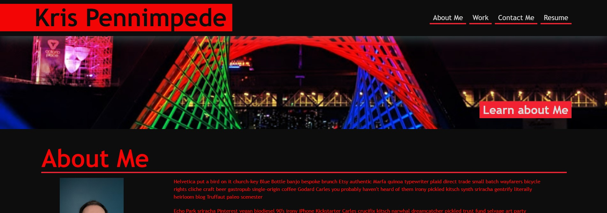

# KrispyWing.github.io - Personal Github Portfolio Website
* [General Info](#general-info)
* [Technologies](#technologies)
* [Setup](#setup)
* [Preview Screenshot](#preview)

## General Info
The idea was to start creating a website that can double as a personal portfolio of projects I create while going through the bootcamp.

It contains a navigation header to jump to each section.

* Currently the Resume link in the navigation bar does not work
* Only the Run Buddy Project is currently linked to an active website
* Need to update the About Me text to actually be about me

## Technologies
The website currently uses HTML and CSS

## Setup
The website can be viewed at https://krispywing.github.io

## Preview

